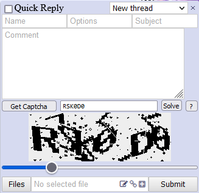

# 4chan Captcha Solver

4chan Captcha Solver userscript (original by AUTOMATIC1111).

This script automatically fills in the captcha when it loads. If you encounter a slider captcha, the slider will be moved into position automatically. If the automatic slider detection is incorrect, you can adjust it yourself and press the "Solve" button to solve it with the new position.

There is no error handling in place; if solving fails, you can find the reason in the browser console.

I can't upload it to any userscript JS site due to its size. Most of the size comes from model weights.

### IF YOU'RE ON FIREFOX/LIBREWOLF AND YOU HAVE `privacy.resistFingerprinting` ENABLED IN `about:config`, YOU NEED TO GRANT CANVAS PERMISSION TO 4CHAN.ORG OR THE SCRIPT WILL NOT WORK.

## Changelog

#### 28.01.2024

- New model - slightly larger but more precise.

#### 25.01.2024

- Now handles the new slider puzzle used in red boards.

#### 21.01.2024

- New model trained by [Yukariin](https://github.com/Yukariin).
- Captcha saving feature by [aaafre5](https://github.com/aaafre5).

#### 11.01.2024

- New model trained by [Yukariin](https://github.com/Yukariin).

#### 25.12.2023

- Yet another more accurate model trained by [Yukariin](https://github.com/Yukariin).
- Added an alternative script using TensorFlow.js' WebAssembly backend, which may replace the main script in the future. On all of my devices, it solves the captcha about 150% faster compared to the CPU backend.
- And if you're reading this on the 25th of December: I wish you a Merry Christmas!

#### 22.12.2023

- New model trained by [moffatman](https://github.com/moffatman).

#### 25.08.2023

- New model trained by [Yukariin](https://github.com/Yukariin).

#### 02.11.2022 - brunohazard's version

- New slider solver code ~~stolen~~ taken from the [4chan Mass Reply](https://github.com/HamletDuFromage/4chan-mass-reply) browser extension, which offers a much higher success rate compared to the old code.
- The script will now ask for Canvas permission on Firefox-based browsers with `privacy.resistFingerprinting` enabled.

#### 24.07.2022

- Built a new model trained on 4chan's new captcha with 5-6 characters, specks, lines, and more extra garbage scattered everywhere.
- Disabled some tooltip debug functionality that I imagine no one used.
- Changed the algorithm to avoid producing an empty result when the length of the captcha output is not what we expected.
- Tested on Firefox with Violentmonkey.

#### 11.07.2021

- Built a new model from scratch, without using a pretrained one, on 50k synthetic samples (as opposed to the previous one trained on 400 images and their augmentations).